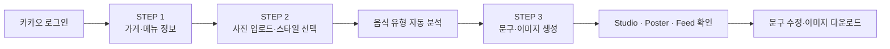
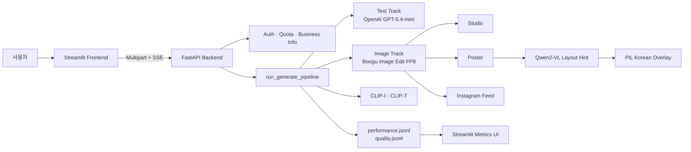

# 📸 소상공인 두레

> **사진 한 장으로, 인스타 광고 콘텐츠까지.**  
> 생성형 AI를 활용해 요식업 소상공인이 별도의 디자인 도구 없이 광고 이미지와 문구를 제작할 수 있도록 돕는 서비스입니다.


## 프로젝트 소개

소상공인은 매장과 메뉴를 직접 촬영할 수 있어도, 이를 SNS에 게시할 광고 콘텐츠로 완성하는 과정에서 촬영 보정, 배경 구성, 카피 작성, 한글 디자인 작업을 각각 수행해야 합니다. 외주 비용과 제작 도구의 학습 부담도 소규모 사업자에게는 큰 장벽입니다.

**소상공인 두레**는 가게 정보와 음식 사진 한 장을 입력받아 다음 결과를 한 번에 생성합니다.

- 원본 음식의 정체성을 살린 **스튜디오 이미지**
- 메뉴명·가격·광고 카피가 포함된 **세로형 포스터**
- SNS 피드에 활용할 수 있는 **클로즈업 이미지**
- 가게 정보, 홍보 목적, 말투를 반영한 **광고 문구**

프로젝트의 목표는 단순히 이미지를 생성하는 것이 아니라, 소상공인이 **오늘 바로 게시할 수 있는 결과물**까지의 거리를 줄이는 것입니다.

## 핵심 기능


### 1. 최소 입력으로 광고 콘텐츠 생성

- 가게 이름, 메뉴 이름, 위치, 가격, 홍보 목적 입력
- JPG, PNG, WEBP 음식 사진 업로드
- 광고 말투와 이미지·문구 요청사항 선택 입력
- 이전 단계로 돌아가도 입력 상태 유지


### 2. 음식 유형 자동 분석과 사용자 제어

업로드한 이미지는 `openai/clip-vit-base-patch32` 기반 zero-shot 분류를 거쳐 서비스가 지원하는 음식 유형으로 자동 분류됩니다. 예측 결과는 기본값으로만 사용되며, 사용자가 직접 수정할 수 있습니다.

지원 음식 유형:

- 국·찌개
- 튀김·치킨
- 구이·바베큐
- 덮밥·볶음·비빔
- 빵·디저트·케이크
- 버거·샌드위치
- 커피·음료


### 3. 한 번의 생성으로 세 가지 이미지 제공


| 결과물            | 비율  | 기본 해상도      | 용도                         |
| -------------- | --- | ----------- | -------------------------- |
| Studio         | 1:1 | 1024 × 1024 | 음식이 중심인 제품·스튜디오 이미지        |
| Poster         | 2:3 | 1024 × 1536 | 메뉴명, 가격, 카피를 포함한 세로형 포스터   |
| Instagram Feed | 2:3 | 1024 × 1536 | SNS 피드·릴스 커버에 적합한 클로즈업 이미지 |


세 결과물은 같은 이미지를 단순 복제하지 않고, 각각의 사용 목적에 맞춰 프롬프트와 구도를 분리합니다.

### 4. 안정적인 한글 텍스트 합성

이미지 생성 모델이 한글까지 직접 그리도록 하면 글자 깨짐, 메뉴명·가격 오탈자, 레이아웃 불안정 문제가 발생합니다. 이를 줄이기 위해 역할을 분리했습니다.

1. **Boogu Image Edit FP8**이 음식과 배경을 자연스럽게 편집합니다.
2. **Qwen2-VL**이 포스터의 색상, 템플릿, scrim 등 레이아웃 힌트를 제안합니다.
3. **PIL 규칙 기반 렌더러**가 메뉴명, 가격, 카피를 정확하게 합성합니다.
4. VLM 분석이 실패하면 규칙 기반 레이아웃으로 자동 전환합니다.


### 5. 카카오 로그인과 사용량 관리

- 카카오 소셜 로그인
- 사용자별 가게 정보 저장
- 일일 생성 횟수 제한
- 이미지 생성이 실제로 성공한 경우에만 사용량 차감
- 개발 환경용 로그인 우회 및 목업 모드


### 6. 실패를 고려한 생성 흐름

- 광고 문구와 이미지 생성 트랙을 겹쳐 실행
- 이미지 생성 실패 시에도 광고 문구는 반환하는 `partial_success` 응답
- SSE 기반 실시간 생성 단계 표시
- 이미지 variant별 빈 결과 발생 시 재시도
- 생성 완료 후 Boogu, VLM, CLIP 등 GPU 리소스 정리
- 모델 로딩 전 RAM 확인 및 선택적 워밍업


## 사용자 흐름




## 서비스 아키텍처




## AI 파이프라인

현재 기본 프로필은 `hybrid_openai_text_hf_image`입니다.

```text
업로드 이미지 + 가게 정보
        │
        ├─ 광고 문구 생성 ─ OpenAI GPT-5.4-mini
        │
        └─ 광고 이미지 생성 ─ Boogu-Image-0.1-Edit-fp8
                 ├─ Studio
                 ├─ Poster ─ Qwen2-VL 분석 ─ PIL 한글 합성
                 └─ Instagram Feed
        │
        ├─ 결과 병합: caption + images[3] + warnings
        ├─ CLIP-I / CLIP-T 품질 평가
        └─ 성능·품질 JSONL 기록
```


### 모델 구성


| 역할       | 기본 모델·기술                              | 설명                                |
| -------- | ------------------------------------- | --------------------------------- |
| 광고 문구    | OpenAI `gpt-5.4-mini`                 | 가게 정보, 메뉴, 가격, 위치, 홍보 목적, 말투 반영   |
| 이미지 편집   | `Boogu/Boogu-Image-0.1-Edit-fp8`      | 레퍼런스 이미지와 instruction 기반 편집       |
| 음식 분류    | `openai/clip-vit-base-patch32`        | 업로드 이미지의 음식 유형 zero-shot 분류       |
| 포스터 레이아웃 | `Qwen/Qwen2-VL-2B-Instruct-GPTQ-Int8` | 색상·템플릿·scrim 등 범주형 레이아웃 힌트 생성     |
| 한글 합성    | Pillow                                | 메뉴명, 가격, 카피의 좌표·크기·스타일을 규칙 기반 렌더링 |
| 품질 평가    | CLIP-I / CLIP-T                       | 원본 정체성 보존과 프롬프트 정렬도 기록            |


`backend/config/model.yaml`에서 OpenAI/HuggingFace 조합과 이미지 모델을 교체할 수 있습니다. SD 3.5 Medium, SDXL Base, SDXL + IP-Adapter, SD 1.5 + ControlNet Tile 등의 실험 구성도 함께 유지합니다.

## 관찰 가능성

생성 품질과 대기 시간을 감각적인 평가에만 의존하지 않도록 JSONL 지표를 기록합니다.

- 전체 파이프라인과 텍스트·이미지 단계별 latency
- Studio, Poster, Feed variant별 생성 시간
- 성공, 부분 성공, 재시도, 오류 유형
- 모델 로딩 및 추론 시간
- VLM 분석, JSON 파싱, 규칙 fallback 여부
- CLIP-I 기반 원본 이미지 보존도
- CLIP-T 기반 프롬프트 정렬도
- 실행 환경, 포트, 모델 프로필 등의 비교 필드

Metrics UI는 기본적으로 `8555` 포트에서 `performance.jsonl`과 `quality.jsonl`을 시각화합니다.

## 기술 스택


| 구분            | 기술                                            |
| ------------- | --------------------------------------------- |
| Frontend      | Streamlit, Python, Pillow                     |
| Backend       | FastAPI, Pydantic, Uvicorn, Loguru            |
| Text AI       | OpenAI Responses API                          |
| Image AI      | PyTorch, Diffusers, Transformers, Boogu Image |
| Vision        | CLIP, Qwen2-VL, ONNX Runtime GPU, rembg       |
| Auth & Data   | Kakao OAuth, JWT, SQLite                      |
| Infra         | Docker, Docker Compose, GCP, NVIDIA L4 GPU    |
| Observability | JSONL Metrics, Streamlit Metrics UI           |


## 프로젝트 구조

```text
.
├── backend/
│   ├── app/
│   │   ├── api/v1/               # 인증, 가게 정보, 광고 생성 API
│   │   ├── core/                 # 설정, 인증, DB, 예외, 동시성·쿼터
│   │   ├── schemas/              # 요청·응답 및 지표 스키마
│   │   ├── services/
│   │   │   ├── pipelines/        # 텍스트·이미지·통합 생성 파이프라인
│   │   │   ├── providers/        # OpenAI/HF 모델 provider
│   │   │   └── eval/             # CLIP 기반 품질 평가
│   │   └── utils/                # PIL 합성, VLM, GPU·로그 유틸리티
│   ├── config/model.yaml          # provider, 모델, 출력 규격 설정
│   ├── Dockerfile.local
│   └── requirements.txt
├── frontend/
│   ├── app.py                     # 3단계 광고 생성 UI
│   ├── metrics_app.py             # 성능·품질 대시보드
│   ├── components/                # 로그인, 입력, 업로드, 결과 UI
│   ├── core/                      # 상태, API client, 인증, metrics
│   ├── assets/                    # CSS 및 정적 리소스
│   └── Dockerfile
├── docker-compose.yml
└── NOTICE
```


## 실행 방법


### 사전 요구사항

- Docker 및 Docker Compose
- NVIDIA GPU와 NVIDIA Container Toolkit
- Python 3.12 기반 환경
- 이미지 생성 전체 파이프라인 기준 **VRAM 24GB급 GPU 권장**
- OpenAI API Key
- HuggingFace 모델 접근이 필요한 경우 HF Token

첫 실행에서는 모델 가중치를 내려받기 때문에 시간이 오래 걸리고 디스크 공간을 많이 사용할 수 있습니다.

### 1. 환경 변수 설정

```bash
cp frontend/.env.example frontend/.env
cp backend/.env.example backend/.env
```

최소한 다음 값을 환경에 맞게 입력합니다.

```dotenv
# backend/.env
OPENAI_API_KEY=
JWT_SECRET_KEY=
HF_TOKEN=

# 카카오 로그인을 사용할 때
KAKAO_CLIENT_ID=
KAKAO_CLIENT_SECRET=
KAKAO_REDIRECT_URI=http://localhost:8010/api/v1/auth/kakao/callback
FRONTEND_BASE_URL=http://localhost:8501
```

```dotenv
# frontend/.env
API_BASE_URL=http://backend:8010
API_BROWSER_BASE_URL=http://localhost:8010
RG_MOCK_MODE=false
RG_DEV_GUEST_MODE=false
```


### 2. 전체 서비스 실행

```bash
docker compose up -d --build
```


| 서비스            | 주소                             |
| -------------- | ------------------------------ |
| 사용자 UI         | `http://localhost:8501`        |
| Backend Health | `http://localhost:8010/health` |


### 3. Metrics UI 함께 실행

```bash
docker compose --profile metrics up -d --build
```

Metrics UI: `http://localhost:8555`

### 4. 프론트엔드 목업 모드

GPU와 백엔드 없이 입력·결과 화면을 확인하려면 `frontend/.env`에서 다음 값을 사용합니다.

```dotenv
RG_MOCK_MODE=true
RG_DEV_GUEST_MODE=true
API_BASE_URL=http://localhost:8010
```

```bash
cd frontend
python -m venv .venv
source .venv/bin/activate  # Windows: .venv\Scripts\activate
pip install -r requirements.txt
streamlit run app.py
```


## 주요 설정

`backend/config/model.yaml`에서 다음 항목을 조정할 수 있습니다.


| 설정                                         | 기본값                           | 설명                      |
| ------------------------------------------ | ----------------------------- | ----------------------- |
| `active_profile`                           | `hybrid_openai_text_hf_image` | 텍스트·이미지 provider 조합     |
| `hf.image_generation.default_model`        | `boogu_edit_fp8`              | 기본 HuggingFace 이미지 모델   |
| `output_image.variant_sizes`               | Studio 1:1, Poster/Feed 2:3   | 결과물별 해상도                |
| `poster_design_analysis.enabled`           | `true`                        | Qwen2-VL 레이아웃 분석 사용 여부  |
| `poster_design_analysis.fallback_to_rules` | `true`                        | VLM 실패 시 규칙 기반 fallback |
| `logging.performance.enabled`              | `true`                        | 성능 JSONL 기록 여부          |


운영 안정성을 위한 주요 환경 변수:


| 변수                                 | 기본값     | 설명                          |
| ---------------------------------- | ------- | --------------------------- |
| `MODEL_WARMUP_ENABLED`             | `false` | 서버 시작 시 모델 자동 로딩 여부         |
| `MODEL_LOAD_MIN_AVAILABLE_RAM_GB`  | `6`     | 모델 로딩 전 최소 가용 RAM           |
| `HF_IMAGE_CPU_OFFLOAD_ENABLED`     | `false` | Diffusers CPU offload 사용 여부 |
| `GENERATION_MAX_CONCURRENT`        | `2`     | 동시 생성 요청 수                  |
| `GENERATION_QUEUE_TIMEOUT_SECONDS` | `15`    | 생성 슬롯 대기 제한                 |
| `DAILY_GENERATION_LIMIT`           | `3`     | 로그인 사용자 일일 생성 한도            |
| `BACKEND_MEMORY_LIMIT`             | `12g`   | 백엔드 컨테이너 RAM 제한             |
| `BACKEND_MEMORY_SWAP_LIMIT`        | `16g`   | 백엔드 컨테이너 RAM+swap 제한        |


## 모델 및 라이선스 안내

이 저장소는 OpenAI API와 여러 HuggingFace 모델을 선택적으로 사용합니다. 각 모델을 배포하거나 상업적으로 활용할 때는 해당 모델의 라이선스와 서비스 약관을 별도로 확인해야 합니다. 저장소에 포함된 제3자 모델 고지는 `[NOTICE](./NOTICE)`를 참고해 주세요.

## 산출물

- **최종 발표 자료 (보고서)** : [PDF 다운로드](./docs/소상공인 두레_최종 발표 자료.pdf)
- **협업 일지**
  - [황예원](https://app.notion.com/p/26-7-1-26-7-30-39016104cddd806bb7b8e2e2a15f58d4?source=copy_link)
  - [박도원](https://app.notion.com/p/3-3acc44689b4380889bb8eb5a9ab17d25?source=copy_link)
  - [손영욱](https://app.notion.com/p/3abdbfa9f10b80da8490f0f4ff285605)
  - [채영환](https://docs.google.com/spreadsheets/d/1XGJzqzpp_N-MORNY8IbwMTJpMqjBjcvbPh0Yb37I_DI/edit?usp=sharing)
  - [천지연](https://app.notion.com/p/AI-9-3923c6dfd7ee80309b4de04a9fcf3474?source=copy_link)

